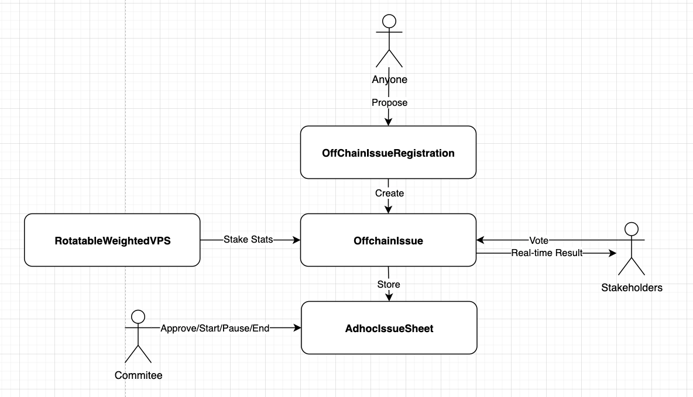

# Governance Framework of IoTeX Blockchain Protocol

IoTeX blockchain protocol is managed by a decentralized community of delegates and voters who hold IOTX coins, who propose and vote on upgrades to the protocol. This is the governance framework for [IoTeX](https://iotex.io) blockchain protocol which extends [EIP1202](https://github.com/ethereum/EIPs/blob/master/EIPS/eip-1202.md), and empowers community governance.

# Overview
A "proposal" is called an "issue" in this governance framework, which is composed of the four main components:
- `OffChainIssueRegistration` serves as the "registration desk" of all issues that anyone can propose
- After creation, an instance of `OffchainIssue` will be created that have all details about a proposal, i.e., the URL to the proposal, hash its content, when to start/stop, and so on. Once the issue is started, voters can vote via https://member.iotex.io/polls
- `AdhocIssueSheet` is the storage and manager of all issues which can be approved/started/paused/ended by the committee members.
- `RotatableWeightedVPS` records all staking information in IoTeX's nsv2 subprotocol every 25 hours, which tells an `OffchainIssue` how to count votes.




# The Life of A Proposal
**1. Anyone can propose by invoking [`register`](https://github.com/iotexproject/IOTX-EIP-1202-contracts/blob/master/contracts/OffChainIssueRegistration.sol#L48) which will be recorded [here](https://github.com/iotexproject/IOTX-EIP-1202-contracts/blob/master/contracts/AdhocIssueSheet.sol).**

For example, one can use ioctl to register as below where `a.abi` is the ABI of `OffChainIssueRegistration` which can be found here [https://github.com/iotexproject/iotex-governance/blob/master/build/contracts/OffChainIssueRegistration.json#L3]:
```
ioctl contract invoke function io17nq7vnm3wcs5a2cmhwhcnhwtwv4s6lxuv7qqj5 a.abi register --with-arguments '{"_metaURI":"https://link-to-your-proposal", "_metaHash":"2f77668a9dfbf8d5848b9eeb4a7145ca94c6ed9236e4a773f6dcafa5132b2f91", "_weighted":true, "_optionCount":"2", "_canRevote":true, "_maxNumOfChoices":1}'
```

One can get all issues like below:
```
ioctl contract test function io1j05ta0krxvpwc4kv2duyjfuyxglqyxkasp3pm9 b.abi getIssues 
--with-arguments '{"_offset":"0", "_limit":"10"}'
```

**2. The whitelisted accounts can [accept](https://github.com/iotexproject/IOTX-EIP-1202-contracts/blob/master/contracts/AdhocIssueSheet.sol#L49) this proposal, [start](https://github.com/iotexproject/IOTX-EIP-1202-contracts/blob/master/contracts/AdhocIssueSheet.sol#L67), [pause](https://github.com/iotexproject/IOTX-EIP-1202-contracts/blob/master/contracts/AdhocIssueSheet.sol#L79), [stop](https://github.com/iotexproject/IOTX-EIP-1202-contracts/blob/master/contracts/AdhocIssueSheet.sol#L103) the proposal.**

Some examples are given below where `b.abi` is the ABI of `AdhocIssueSheet` which can be found here [https://github.com/iotexproject/iotex-governance/blob/master/build/contracts/AdhocIssueSheet.json#L3]:
```
// Approve an issue 
ioctl contract invoke function io1j05ta0krxvpwc4kv2duyjfuyxglqyxkasp3pm9 b.abi approve --with-arguments '{"_issue":"0xae1443e2966539585780b9971018fa413f3c4c5e"}'

// Check if one issue is approved
ioctl contract test function io1j05ta0krxvpwc4kv2duyjfuyxglqyxkasp3pm9 b.abi approved --with-arguments '{"_issue":"0xae1443e2966539585780b9971018fa413f3c4c5e"}'

// Start the issue
ioctl contract invoke function io1j05ta0krxvpwc4kv2duyjfuyxglqyxkasp3pm9 b.abi startIssue --with-arguments '{"_issue":"0xae1443e2966539585780b9971018fa413f3c4c5e"}'
```

**3. Once it is started, voters can vote via [`vote`](https://github.com/iotexproject/IOTX-EIP-1202-contracts/blob/master/contracts/OffchainIssue.sol#L119).**

Behind the scene, IoTeX's stakeholders and voters information are injected into [`RotatableWeightedVPS`](https://github.com/iotexproject/iotex-governance/tree/master/contracts/VPS) every 25 hours. `RotatableWeightedVPS` - considered as a system contract - is used by [VITA claim](https://iotex.io/vita) and [poll](https://member.iotex.io).


# Mainnet Deployment
`RotatableWeightedVPS` - [io1476tz4nx8v8qc5xdpu3hclk0uyanus6x2laddq](https://www.iotexscan.io/address/io1476tz4nx8v8qc5xdpu3hclk0uyanus6x2laddq)

`OffChainIssueRegistration` - [io17nq7vnm3wcs5a2cmhwhcnhwtwv4s6lxuv7qqj5](https://www.iotexscan.io/address/io17nq7vnm3wcs5a2cmhwhcnhwtwv4s6lxuv7qqj5)

`AdhocIssueSheet` - [io1j05ta0krxvpwc4kv2duyjfuyxglqyxkasp3pm9](https://www.iotexscan.io/address/io1j05ta0krxvpwc4kv2duyjfuyxglqyxkasp3pm9)

# Contract Development

## Compile

`truffle compile`

## Test

`truffle test`

## Lint

`npm install truffle-plugin-solhint`

`truffle run solhint`
